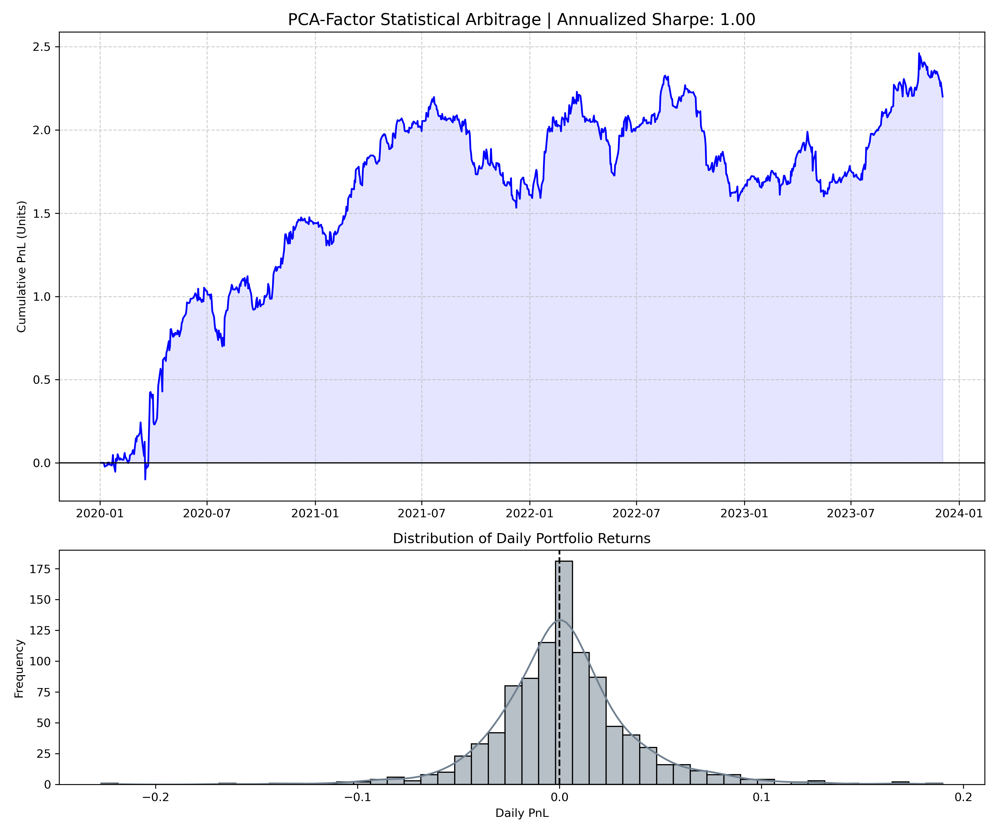
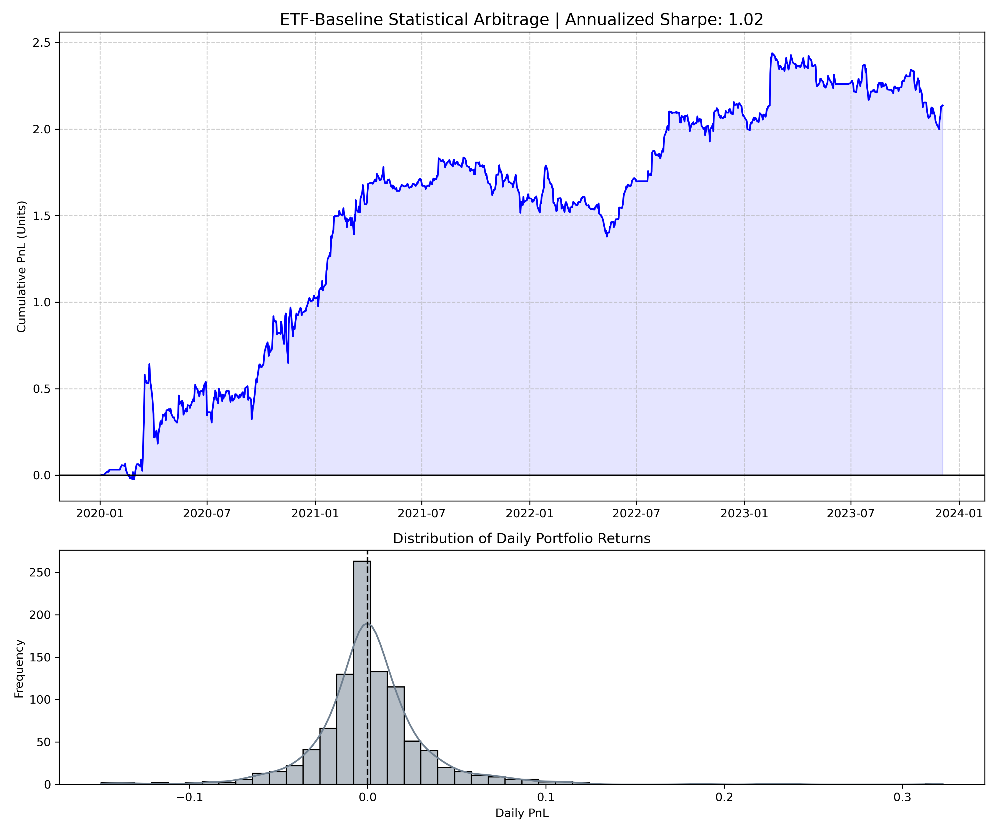

# 🚀 Eigenportfolio Statistical Arbitrage  
**Causal Walk-Forward Implementation of Avellaneda–Lee (2008)**  
**PCA vs ETF Factor Models in Modern Equity Markets**

---

## 📌 Executive Summary

- Built a **fully causal statistical arbitrage pipeline** with strict train / validation / test separation  
- Compared:
  - **ETF-based factor neutralization**
  - **PCA-based eigenportfolio decomposition**
- Modeled residuals via **Ornstein–Uhlenbeck mean-reversion**
- Achieved:
  - ETF Sharpe ≈ **0.50**
  - PCA Sharpe ≈ **0.53**  
- Tested statistical significance using **paired block bootstrap (10,000 iterations)**  
- Found:

> **No statistically significant improvement from PCA over ETF baseline (p ≈ 0.50)**

---

## 📈 Key Results

### PCA Strategy (Out-of-Sample)

- Smooth equity growth but with regime-dependent drawdowns  
- Sharpe ≈ **0.53**

---

### ETF Baseline (Out-of-Sample)

- Comparable performance with lower model complexity  
- Sharpe ≈ **0.50**

---

### Statistical Significance

- Observed ΔSharpe ≈ **0.024**
- Empirical p-value ≈ **0.497**

\[
\Rightarrow \text{No statistically significant edge}
\]

---

## 🧠 Methodology

### Factor Neutralization

#### ETF Model
\[
r_{i,t} = \alpha_i + \beta_i r_{ETF(i),t} + \epsilon_{i,t}
\]

#### PCA Model
\[
r_t = B f_t + \epsilon_t
\]

- \(B\): eigenvectors of correlation matrix  
- \(f_t\): latent factors  
- \(\epsilon_t\): idiosyncratic residuals  

---

### Mean-Reversion Signal

\[
x_t = \sum_{\tau \le t} \epsilon_\tau
\]

\[
dx_t = \kappa(\mu - x_t)\,dt + \sigma\,dW_t
\]

\[
z_t = \frac{x_t - \mu}{\sigma / \sqrt{2\kappa}}
\]

---

### Trading Rule

- Long if \(z_t < -\theta_{entry}\)  
- Short if \(z_t > \theta_{entry}\)  
- Exit if \(|z_t| < \theta_{exit}\)

---

## ⚙️ Backtesting Framework

Strict **causal walk-forward pipeline**:

\[
\text{Train} \rightarrow \text{Validation} \rightarrow \text{Test}
\]

Key design decisions:

- No look-ahead bias  
- Universe defined using **training data only**  
- Hyperparameters tuned on **validation window only**  
- Parameters frozen before test  
- Missing data handled without leakage  

---

## 🔁 Walk-Forward Optimization

- Rolling window:
  - 252-day training  
  - 21-day validation  
  - 21-day test  

- Hyperparameters tuned dynamically each window  
- Example variability:

 [oai_citation:0‡data/results/validation_sharpe.txt](sediment://file_000000006870720c8e377ff394166a17)

This instability highlights:

> **Parameter sensitivity and regime dependence in statistical arbitrage**

---

## 💸 Transaction Costs

\[
\text{cost}_t = c \cdot \|w_t - w_{t-1}\|_1
\]

- Default: **5 bps**
- Scales with gross exposure
- Penalizes multi-factor PCA hedging more heavily

---

## 📊 Performance Summary

| Strategy | Sharpe | Complexity |
|----------|--------|----------|
| ETF | 0.5035 | Low |
| PCA | 0.5273 | Higher |

---

## 🔬 Statistical Validation

We test:

\[
d_t = r^{PCA}_t - r^{ETF}_t
\]

Using **paired block bootstrap**:

- Preserves serial correlation  
- Preserves cross-correlation  
- 10,000 resampled paths  

Result:

\[
\mathbb{P}(\Delta S \le 0) \approx 0.50
\]

> PCA improvement is statistically indistinguishable from noise

---

## 🧩 Key Insights

- PCA improves factor modeling **theoretically**, but:
  - increases trading costs  
  - introduces instability  
- Net effect: **no robust alpha gain**
- Confirms:
  
\[
\text{Modern markets} \Rightarrow \text{weak stat-arb signal}
\]

---

## ⚠️ Limitations

- Fixed OU parameters  
- No volatility modeling (ARCH/GARCH)  
- No regime detection (HMM)  
- Limited universe (S&P 100)  

---

## 🔮 Future Work

- Volatility-aware modeling (ARCH/GARCH)  
- Regime detection (Hidden Markov Models)  
- Adaptive factor selection  
- Execution-aware optimization  

---

## 🗂️ Project Structure
src/
├── data_pipeline.py
├── factor_models.py
├── strategy_engine.py
├── math_utils.py
├── plotting_utils.py
data/
├── raw/
├── results/
    ├── correlation_heatmap.png
    ├── correlation_histogram.png
    ├── etf_performance.png
    ├── pca_performance.png
    ├── bootstrap_hist.png
notebooks/
├── strategy_exec.ipynb

---

## 🎯 Final Takeaway

> A realistic, bias-free implementation shows that  
> **PCA-based statistical arbitrage does not deliver a significant edge over simpler ETF-based strategies in modern markets.**

---

## 👤 Author

**Saurabh Gupta**  
MSc ETH Physics (ETH Zurich), BTech Engineering Physics (IIT Delhi)
Focus: Quantitative Research | Stochastic Processes | ML for Finance  